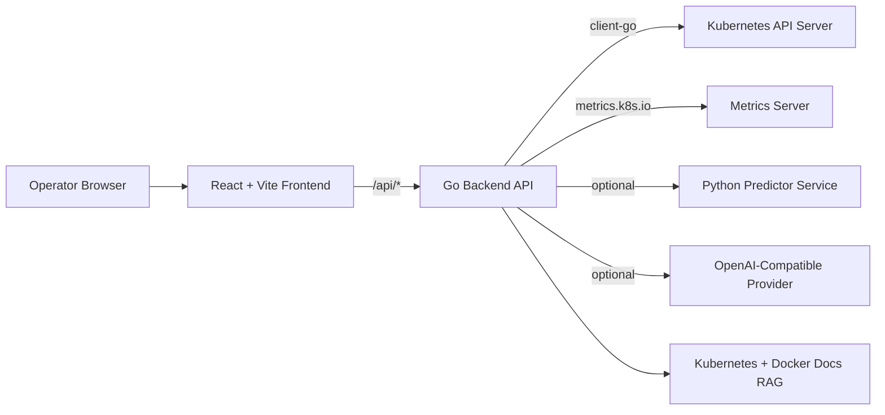

# KubeLens AI

KubeLens AI is a full-stack Kubernetes operations dashboard focused on practical SRE workflows: observe the cluster, diagnose failures, predict incidents, and execute safe actions from one place.

It is designed to run in two modes:
- Mock mode (deterministic data, no cluster required)
- Real mode (live Kubernetes + live metrics)

---

## Table of Contents
- [1. Core Capabilities](#1-core-capabilities)
- [2. Architecture](#2-architecture)
- [3. How Features Work](#3-how-features-work)
- [4. Mock Mode vs Real Mode](#4-mock-mode-vs-real-mode)
- [5. Quick Start](#5-quick-start)
- [6. Run With Real Cluster and Real Metrics](#6-run-with-real-cluster-and-real-metrics)
- [7. Assistant RAG and AI Provider](#7-assistant-rag-and-ai-provider)
- [8. Environment Variables](#8-environment-variables)
- [9. API Surface](#9-api-surface)
- [10. Project Structure](#10-project-structure)
- [11. Docker Deployment](#11-docker-deployment)
- [12. Kubernetes Deployment](#12-kubernetes-deployment)
- [13. Developer Workflow](#13-developer-workflow)
- [14. Troubleshooting](#14-troubleshooting)
- [15. Screenshots](#15-screenshots)

---

## 1. Core Capabilities

- Cluster inventory: pods, nodes, deployments, services, ingresses, configmaps, secrets, volumes, RBAC, and more.
- Live usage telemetry: pod/node CPU and memory via `metrics.k8s.io` when available.
- Diagnostics engine: deterministic, auditable issue detection with severity + recommendations.
- Predictions engine: external Python predictor with local fallback for resilience.
- Assistant: intent-aware responses, optional AI enhancement, and documentation-grounded citations (RAG).
- Auth + RBAC: token-based viewer/operator/admin roles for API and UI actions.
- Audit trail: structured request/action history with operator attribution.
- Real-time stream: server-sent events (SSE) for live audit + cluster stats updates.
- Terminal execution: run shell commands from UI with timeout and output capture.
- Operational actions: create/restart/delete pod, cordon node, scale/restart/rollback workloads, edit/apply resource YAML.

---

## 2. Architecture



Request flow:
1. UI calls backend endpoints under `/api/*`.
2. Backend reads Kubernetes resources and metrics.
3. Diagnostics + predictions are generated.
4. Assistant composes deterministic response, optionally enhanced by AI and grounded by RAG docs.
5. UI renders charts, issue tables, assistant guidance, and resource actions.

---

## 3. How Features Work

### Diagnostics
- Source: `backend/internal/diagnostics/analysis_*`
- Rule-based analysis of pods and nodes (e.g., failed pods, pending pods, restart pressure, NotReady nodes).
- Output: health score, severity-ranked issues, recommendations, narrative summary.

### Predictions
- Endpoint: `GET /api/predictions`
- Backend tries Python predictor service first.
- If unavailable, backend returns local deterministic fallback predictions.
- Compatibility alias supported: `/api/predictive-incidents`.

### Assistant
- Endpoint: `POST /api/assistant`
- Intent routing for `diagnose`, `health`, `manifest`, and `priority` queries.
- Optional AI provider enhancement (`ASSISTANT_PROVIDER=openai_compatible`).
- RAG grounding retrieves relevant Kubernetes/Docker docs and returns citations/snippets.

### Terminal
- Endpoint: `POST /api/terminal/exec`
- Executes shell commands with guardrails:
  - command required
  - max command length
  - timeout cap
  - stdout/stderr + exit code returned

### Auth and access control
- Endpoint: `GET /api/auth/session`
- Disabled by default (`AUTH_ENABLED=false`), enabled by setting `AUTH_ENABLED=true`.
- Role model:
  - `viewer`: read-only APIs + assistant + stream
  - `operator`: viewer + operational write actions
  - `admin`: operator + terminal execution

### Audit trail and live stream
- Endpoint: `GET /api/audit?limit=150`
- Stream endpoint: `GET /api/stream` (SSE)
- Every API call is recorded with method/path/status/duration/user/role and exposed in the Audit view.
- Stream emits:
  - `audit` events for request/activity changes
  - `stats` events for periodic cluster summary updates

---

## 4. Mock Mode vs Real Mode

### Mock mode
When `KUBECONFIG_DATA` is empty/invalid:
- deterministic mock resources are served
- diagnostics and predictions still function
- actions are simulated in-memory

### Real mode
When `KUBECONFIG_DATA` is valid base64 kubeconfig:
- live Kubernetes objects are queried
- real metrics are used if Metrics Server is available
- actions execute against actual cluster resources

---

## 5. Quick Start

Prerequisites:
- Node.js 20+
- Go 1.25+
- npm

Install and run:

```bash
npm install
npm run dev
```

Local URLs:
- Frontend: `http://localhost:5173`
- Backend: `http://localhost:3000`

---

## 6. Run With Real Cluster and Real Metrics

1. Validate cluster access:

```bash
kubectl cluster-info
kubectl get nodes
```

2. Validate Metrics Server:

```bash
kubectl top nodes
kubectl top pods -A
```

3. Export kubeconfig as base64.

PowerShell:

```powershell
$bytes = [System.IO.File]::ReadAllBytes("$HOME\.kube\config")
$env:KUBECONFIG_DATA = [Convert]::ToBase64String($bytes)
npm run dev
```

Bash:

```bash
export KUBECONFIG_DATA=$(base64 -w 0 ~/.kube/config)
npm run dev
```

---

## 7. Assistant RAG and AI Provider

### RAG (documentation grounding)
- Enabled by default.
- Uses Kubernetes and Docker documentation sources.
- Returns references + snippets in assistant responses.

Control via env:
- `ASSISTANT_RAG_ENABLED=true|false`

### AI provider (optional)
To enable model-enhanced assistant responses:
- `ASSISTANT_PROVIDER=openai_compatible`
- set API key/model/base URL variables

If provider fails/unavailable, assistant falls back safely to deterministic local logic.

---

## 8. Environment Variables

| Variable | Default | Description |
|---|---|---|
| `KUBECONFIG_DATA` | `""` | Base64 kubeconfig payload for real cluster mode |
| `PORT` | `3000` | Backend port |
| `DIST_DIR` | `dist` | Frontend static build directory |
| `PREDICTOR_BASE_URL` | `""` | Predictor service base URL |
| `PREDICTOR_TIMEOUT_SECONDS` | `4` | Predictor request timeout |
| `ASSISTANT_PROVIDER` | `none` | `none` or `openai_compatible` |
| `ASSISTANT_TIMEOUT_SECONDS` | `8` | AI provider timeout |
| `ASSISTANT_API_BASE_URL` | `https://api.openai.com/v1` | OpenAI-compatible API base URL |
| `ASSISTANT_API_KEY` | `""` | Provider API key |
| `ASSISTANT_MODEL` | `""` | Provider model name |
| `ASSISTANT_TEMPERATURE` | `0.2` | Provider temperature |
| `ASSISTANT_MAX_TOKENS` | `700` | Provider max output tokens |
| `ASSISTANT_RAG_ENABLED` | `true` | Enable/disable docs RAG grounding |
| `AUTH_ENABLED` | `false` | Enable bearer-token auth and role checks |
| `AUTH_TOKENS` | `""` | Comma-separated `user:role:token` entries |
| `APP_VERSION` | `dev` | Build metadata |
| `APP_COMMIT` | `local` | Build metadata |
| `APP_BUILT_AT` | current UTC | Build metadata |

Reference file: `.env.example`

---

## 9. API Surface

Core endpoints:

- `GET /api/cluster-info`
- `GET /api/stats`
- `GET /api/auth/session`
- `GET /api/pods`
- `GET /api/nodes`
- `GET /api/events`
- `GET /api/audit`
- `GET /api/stream` (SSE)
- `GET /api/resources/{kind}`
- `GET /api/resources/{kind}/{namespace}/{name}/yaml`
- `PUT /api/resources/{kind}/{namespace}/{name}/yaml`
- `POST /api/resources/{kind}/{namespace}/{name}/scale`
- `POST /api/resources/{kind}/{namespace}/{name}/restart`
- `POST /api/resources/{kind}/{namespace}/{name}/rollback`
- `GET /api/diagnostics`
- `GET /api/predictions`
- `POST /api/assistant`
- `POST /api/terminal/exec`
- `GET /api/version`

---

## 10. Project Structure

```text
.
+- backend/
|  +- cmd/server/
|  +- internal/
|     +- ai/          # AI provider interface + OpenAI-compatible implementation
|     +- apperrors/   # shared backend error types
|     +- cluster/     # query_*, command_*, mapper_*, service_*, support_*
|     +- diagnostics/ # analysis_* + present_*
|     +- httpapi/     # transport + handlers
|     +- model/       # API data contracts
|     +- rag/         # docs retrieval and grounding
+- predictor/         # FastAPI predictor service
+- src/
|  +- components/     # shared UI components
|  +- features/
|  +- lib/
|  +- views/<view>/   # feature view folders
+- k8s/               # Kubernetes manifests
+- scripts/           # tooling scripts (including structure lint)
```

---

## 11. Docker Deployment

Build and run app image:

```bash
npm run docker:build
npm run docker:run
```

Run full stack (dashboard + predictor):

```bash
npm run docker:up
npm run docker:down
```

---

## 12. Kubernetes Deployment

Apply manifests:

```bash
kubectl apply -k k8s
```

Key files:
- `k8s/namespace.yaml`
- `k8s/deployment.yaml`
- `k8s/service.yaml`
- `k8s/predictor-deployment.yaml`
- `k8s/predictor-service.yaml`
- `k8s/configmap.yaml`
- `k8s/secret.example.yaml`

More detail:
- `k8s/README.md`
- `RUN_AND_USE.md`

---

## 13. Developer Workflow

Quality gates:

```bash
npm run lint
npm run test:go
npm run build
```

Go formatting:

```bash
npm run fmt:go
```

CI:
- Workflow: `.github/workflows/ci.yml`
- Runs lint, Go tests, and frontend build on push/PR.

---

## 14. Troubleshooting

- Predictions page returns `404`:
  - backend process is likely outdated; restart API.
- CPU/memory shows `N/A`:
  - Metrics Server missing/unavailable or RBAC denied.
- Assistant response too generic:
  - AI provider may be disabled/unavailable; deterministic fallback is active.
  - verify `ASSISTANT_PROVIDER`, `ASSISTANT_API_KEY`, and backend logs.
- No documentation references in assistant:
  - verify `ASSISTANT_RAG_ENABLED=true`.
- Terminal command fails:
  - inspect `stderr`, `exitCode`, `durationMs`; check command/cwd/timeout.

---

## 15. Screenshots


