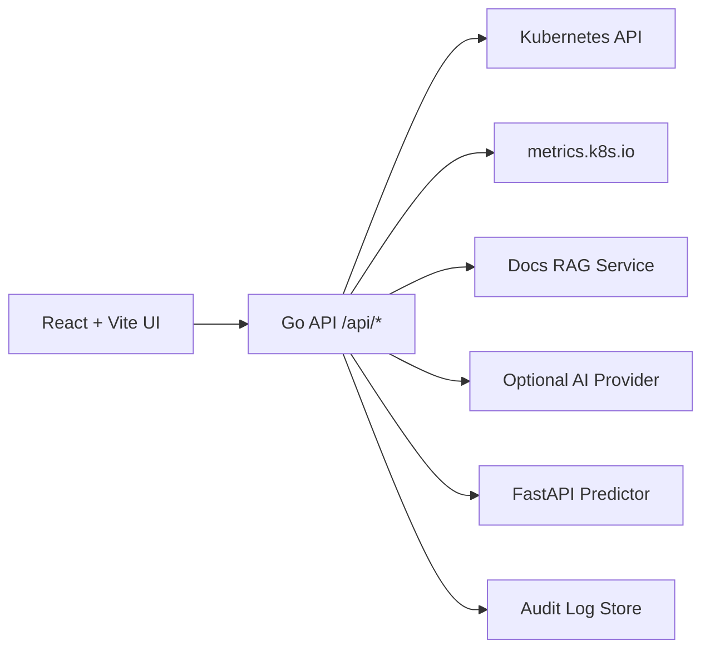

# KubeLens AI

KubeLens AI is a full-stack Kubernetes operations dashboard designed for two workflows:

- fast local evaluation with deterministic mock data
- controlled live-cluster operations with explicit security gates

It combines inventory, diagnostics, predictions, assistant guidance, audit history, and operator actions under one UI.

## What is implemented today

- Live or mock cluster inventory across workloads, networking, storage, access, and events
- Metrics integration (`metrics.k8s.io`) when Metrics Server is available
- Diagnostics engine (rule-based risk scoring + recommendations)
- Predictor service (FastAPI) with backend fallback behavior
- Assistant with deterministic flow + optional provider + docs RAG grounding
- Role-based auth session, audit trail, and rate limiting controls
- Health/readiness endpoints (`/api/healthz`, `/api/readyz`) and published API contract (`/api/openapi.yaml`)
- Multi-cluster selection (`/api/clusters`, `/api/clusters/select`)
- Kubernetes deployment base + `dev`/`demo`/`prod` overlays with RBAC, NetworkPolicy, PDB, HPA

## Safety model (important)

Secure defaults are now enforced:

- `APP_MODE` defaults to `demo`
- `WRITE_ACTIONS_ENABLED=false` by default
- no fallback auth tokens unless `DEV_MODE=true`
- `prod` mode requires auth and explicit tokens

When running in `dev`/`demo` or insecure combinations, the UI shows a warning banner and capability state.

## Mode matrix

| Mode   | Intended use               | Auth default | Write actions |
| ------ | -------------------------- | ------------ | ------------- |
| `dev`  | local engineering          | off          | off           |
| `demo` | safe showcase/read-focused | off          | off           |
| `prod` | controlled operations      | on           | off           |

Notes:

- writes are opt-in in every mode.
- enabling writes without auth is rejected at startup.

## Architecture



More details: [Architecture](docs/ARCHITECTURE.md)
Security references: [Security](docs/SECURITY.md), [Threat Model](docs/THREAT_MODEL.md), [Ops Verification](docs/OPERATIONS_VERIFICATION.md)

## Run locally

### 1) Install

```bash
npm install
```

### 2) Start in default demo mode (safe)

```bash
npm run dev
```

- Frontend: `http://localhost:5173`
- Backend: `http://localhost:3000`

In this mode:

- data can be mock if no kubeconfig is supplied
- mutating actions are blocked unless explicitly enabled

## Run with a real cluster + real metrics

### 1) Verify cluster connectivity

```bash
kubectl cluster-info
kubectl get nodes
```

### 2) Verify metrics pipeline

```bash
kubectl top nodes
kubectl top pods -A
```

### 3) Provide kubeconfig payload

PowerShell:

```powershell
$bytes = [System.IO.File]::ReadAllBytes("$HOME\.kube\config")
$env:KUBECONFIG_DATA = [Convert]::ToBase64String($bytes)
npm run dev
```

Bash:

```bash
export KUBECONFIG_DATA=$(base64 -w 0 ~/.kube/config)
npm run dev
```

## Auth and RBAC

### Token format

`AUTH_TOKENS` uses:

```text
user:role:token,user:role:token
```

Example:

```text
viewer:viewer:token1,operator:operator:token2,admin:admin:token3
```

### Roles

- `viewer`: read-only + assistant/stream
- `operator`: viewer + write actions (if globally enabled)
- `admin`: operator + administrative policies

### Auth transport hardening

- `Authorization: Bearer <token>` is the primary auth path.
- `X-Auth-Token` is disabled by default and should remain off (`AUTH_ALLOW_HEADER_TOKEN=false`).
- Cookie-authenticated mutating requests enforce same-origin checks using `Origin`/`Referer`.
- Optional cross-domain frontends can be allowlisted with `AUTH_TRUSTED_CSRF_DOMAINS`.

## Predictor service

The predictor is a first-class service (`predictor/`):

- contract-based FastAPI endpoint: `POST /predict`
- input validation via Pydantic
- tests for valid/invalid requests
- backend fallback path if predictor is unavailable

Run predictor locally:

```bash
npm run docker:build:predictor
npm run docker:run:predictor
```

Set backend endpoint:

```text
PREDICTOR_BASE_URL=http://localhost:8001
PREDICTOR_SHARED_SECRET=your-shared-secret
```

## Docker

```bash
npm run docker:up
npm run docker:down
```

## Kubernetes deployment

Overlay-based deploy:

```bash
kubectl apply -k k8s/overlays/dev
kubectl apply -k k8s/overlays/demo
kubectl apply -k k8s/overlays/prod
```

Default root target:

```bash
kubectl apply -k k8s
```

Details: [k8s/README.md](k8s/README.md)

## Quality gates

```bash
npm run lint
npm run test:go
npm run test:web
npm run test:e2e
npm run test:predictor
npm run verify:release
npm run verify:changelog
npm run verify:openapi
npm run build
```

CI validates:

- frontend lint/tests/build
- backend tests + gofmt check
- Playwright smoke E2E
- Playwright auth role-matrix E2E
- predictor lint/tests
- release/version consistency across package, Docker, and k8s manifests
- changelog/version discipline
- OpenAPI contract validation
- Docker builds (dashboard + predictor)
- kustomize + manifest schema validation

## Troubleshooting

- `404` on predictions:
  - verify backend is running latest code
  - verify predictor URL and readiness (`/api/readyz`)
- CPU/memory as `N/A`:
  - metrics server likely unavailable; validate with `kubectl top`
- `403` for write actions:
  - expected unless both role and global feature flags allow it
- Auth in prod fails on startup:
  - set `AUTH_ENABLED=true` and provide `AUTH_TOKENS` (or secret in k8s)

## Maintainer workflow

- Change summary and release history are tracked in [CHANGELOG.md](CHANGELOG.md).
- PR expectations and merge checklist are defined in [.github/pull_request_template.md](.github/pull_request_template.md).

## Screenshots


