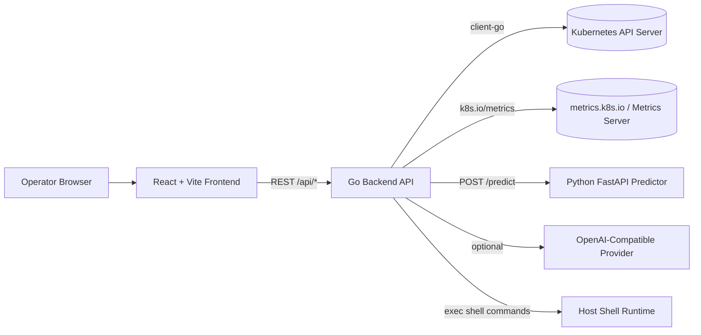
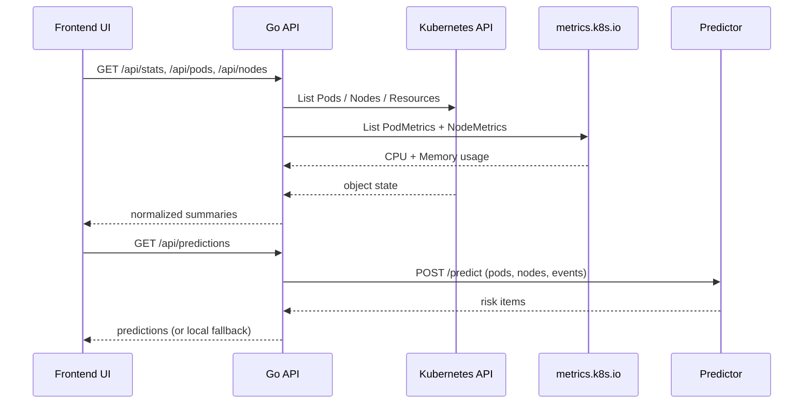
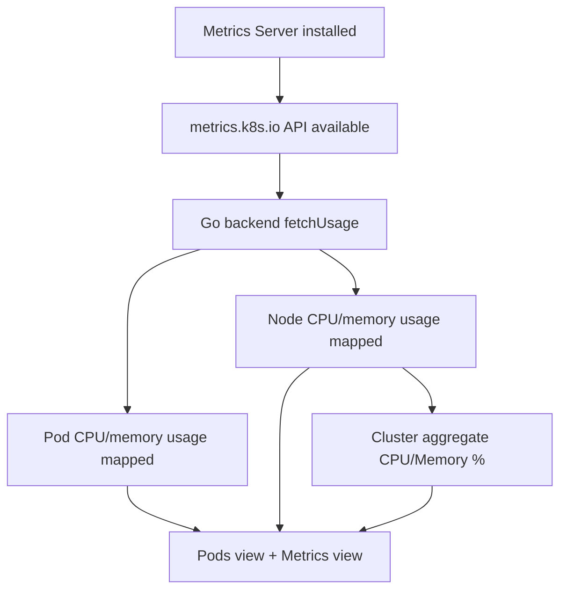
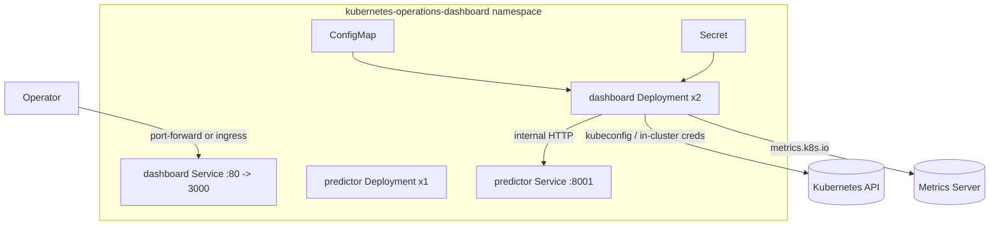

# Kubernetes Operations Dashboard (KubeLens AI)

An academic full-stack Kubernetes operations project focused on **observability, diagnostics, predictions, and operator workflows**.

This system is designed to run in two modes:

- **Live cluster mode**: reads real Kubernetes resources and real CPU/memory usage from `metrics.k8s.io`.
- **Deterministic mock mode**: no cluster required, predictable data for demos and testing.

---

## Table of Contents

- [1) Project Overview](#1-project-overview)
- [2) What The Dashboard Does](#2-what-the-dashboard-does)
- [3) Architecture Diagrams](#3-architecture-diagrams)
- [4) Repository Structure](#4-repository-structure)
- [5) Prerequisites](#5-prerequisites)
- [6) Quick Start (Mock Mode)](#6-quick-start-mock-mode)
- [7) Run With Real Cluster + Real Metrics](#7-run-with-real-cluster--real-metrics)
- [8) Predictor Service (Optional, but Recommended)](#8-predictor-service-optional-but-recommended)
- [9) Environment Variables](#9-environment-variables)
- [10) API Surface](#10-api-surface)
- [11) Docker Workflow](#11-docker-workflow)
- [12) Kubernetes Deployment Workflow](#12-kubernetes-deployment-workflow)
- [13) Screenshots](#13-screenshots)
- [14) Troubleshooting](#14-troubleshooting)
- [15) Security Notes](#15-security-notes)

---

## 1) Project Overview

I built this project as an academic engineering exercise to answer one practical question:

> How can raw Kubernetes state be converted into operational decisions quickly, in one interface?

Instead of only listing objects, this dashboard adds:

- issue prioritization,
- health scoring,
- predictive incident risk,
- API observability,
- in-app terminal actions,
- and assistant-guided troubleshooting.

---

## 2) What The Dashboard Does

### Cluster / Workload Management

- Pods, Nodes, Deployments, ReplicaSets, StatefulSets, DaemonSets, Jobs, CronJobs
- Services, Ingresses, NetworkPolicies
- ConfigMaps, Secrets, ServiceAccounts, RBAC
- PersistentVolumes, PVCs, StorageClasses

### Operational Actions

- Create / restart / delete pods
- Cordon nodes
- Edit resource YAML
- Scale workloads
- Restart workloads
- Rollback deployments

### Intelligence Features

- Diagnostics engine with severity-ranked findings
- Predictions engine (Python service) with local fallback
- Assistant endpoint with deterministic fallback
- API route metrics and latency analytics

---

## 3) Architecture Diagrams

### 3.1 High-Level System Architecture



### 3.2 Request + Data Flow



### 3.3 Real Metrics Pipeline



### 3.4 Deployment Topology (Kubernetes)



---

## 4) Repository Structure

```text
.
+- backend/
¦  +- cmd/server/
¦  +- internal/
¦     +- ai/
¦     +- apperrors/
¦     +- cluster/
¦     +- diagnostics/
¦     +- httpapi/
¦     +- model/
+- predictor/
¦  +- app/main.py
¦  +- requirements.txt
¦  +- Dockerfile
+- src/
¦  +- components/
¦  +- features/
¦  +- lib/
¦  +- types.ts
+- k8s/
¦  +- namespace.yaml
¦  +- configmap.yaml
¦  +- deployment.yaml
¦  +- service.yaml
¦  +- predictor-deployment.yaml
¦  +- predictor-service.yaml
¦  +- secret.example.yaml
¦  +- kustomization.yaml
+- screenshots/
+- Dockerfile
+- docker-compose.yml
+- RUN_AND_USE.md
+- README.md
```

---

## 5) Prerequisites

- Node.js 20+
- Go 1.25+
- npm

For real-cluster mode:

- `kubectl` configured to target your cluster
- Cluster access permissions
- Metrics Server (`metrics.k8s.io`) for real CPU/memory usage

---

## 6) Quick Start (Mock Mode)

This mode requires **no Kubernetes cluster**.

```bash
npm install
npm run dev
```

- Frontend: `http://localhost:5173`
- Backend API: `http://localhost:3000`

If `KUBECONFIG_DATA` is empty, backend automatically serves deterministic mock data.

---

## 7) Run With Real Cluster + Real Metrics

### Step 1: Verify `kubectl` context

```bash
kubectl cluster-info
kubectl get nodes
```

### Step 2: Verify Metrics Server is available

Linux/macOS:

```bash
kubectl get apiservices | grep metrics.k8s.io
kubectl top nodes
kubectl top pods -A
```

PowerShell (Windows):

```powershell
kubectl get apiservices | findstr metrics.k8s.io
kubectl top nodes
kubectl top pods -A
```

If `kubectl top` fails, install/repair Metrics Server before expecting real metrics in UI.

### Step 3: Set `KUBECONFIG_DATA`

PowerShell:

```powershell
$bytes = [System.IO.File]::ReadAllBytes("$HOME\.kube\config")
$env:KUBECONFIG_DATA = [Convert]::ToBase64String($bytes)
```

Bash:

```bash
export KUBECONFIG_DATA="$(base64 -w 0 ~/.kube/config)"
```

### Step 4: Start app

```bash
npm run dev
```

### Step 5: Validate from API

```bash
curl http://localhost:3000/api/cluster-info
curl http://localhost:3000/api/pods
curl http://localhost:3000/api/nodes
curl http://localhost:3000/api/stats
```

Expected:

- `/api/cluster-info` shows `isRealCluster: true`
- pod/node CPU-memory fields are populated (not `N/A`) when Metrics Server is healthy

---

## 8) Predictor Service (Optional, but Recommended)

The Go backend can run predictions locally (fallback), but best setup is with predictor service enabled.

### Local predictor run

```bash
cd predictor
python -m pip install -r requirements.txt
python -m uvicorn app.main:api --host 0.0.0.0 --port 8001
```

Set backend env var:

```bash
PREDICTOR_BASE_URL=http://localhost:8001
```

or in PowerShell:

```powershell
$env:PREDICTOR_BASE_URL="http://localhost:8001"
```

Then run `npm run dev`.

---

## 9) Environment Variables

| Variable | Required | Description | Default |
|---|---:|---|---|
| `KUBECONFIG_DATA` | No | Base64 kubeconfig payload for live cluster mode | empty |
| `PORT` | No | Go API port | `3000` |
| `DIST_DIR` | No | Frontend build folder served by backend | `dist` |
| `PREDICTOR_BASE_URL` | No | Predictor service base URL | empty (or compose default) |
| `PREDICTOR_TIMEOUT_SECONDS` | No | Predictor timeout | `4` |
| `ASSISTANT_PROVIDER` | No | `none` or `openai_compatible` | `none` |
| `ASSISTANT_TIMEOUT_SECONDS` | No | Assistant timeout | `8` |
| `ASSISTANT_API_BASE_URL` | No | OpenAI-compatible base URL | `https://api.openai.com/v1` |
| `ASSISTANT_API_KEY` | No | Assistant provider key | empty |
| `ASSISTANT_MODEL` | No | Assistant model ID | empty |
| `ASSISTANT_TEMPERATURE` | No | Assistant temperature | `0.2` |
| `ASSISTANT_MAX_TOKENS` | No | Assistant output cap | `700` |

You can start from [`.env.example`](./.env.example).

---

## 10) API Surface

### System / Health

- `GET /api/version`
- `GET /api/cluster-info`
- `GET /api/metrics` (API observability metrics)
- `GET /api/stats`

### Core Resources

- `GET /api/namespaces`
- `GET /api/pods`
- `GET /api/nodes`
- `GET /api/resources/{kind}`

### Pod/Node Actions

- `POST /api/pods`
- `POST /api/pods/{namespace}/{name}/restart`
- `DELETE /api/pods/{namespace}/{name}`
- `GET /api/pods/{namespace}/{name}`
- `GET /api/pods/{namespace}/{name}/events`
- `GET /api/pods/{namespace}/{name}/logs`
- `POST /api/nodes/{name}/cordon`
- `GET /api/nodes/{name}`

### Workload Actions

- `GET /api/resources/{kind}/{namespace}/{name}/yaml`
- `PUT /api/resources/{kind}/{namespace}/{name}/yaml`
- `POST /api/resources/{kind}/{namespace}/{name}/scale`
- `POST /api/resources/{kind}/{namespace}/{name}/restart`
- `POST /api/resources/{kind}/{namespace}/{name}/rollback`

### Intelligence

- `GET /api/diagnostics`
- `GET /api/predictions`
- `GET /api/predictive-incidents` (compat alias)
- `POST /api/assistant`

### Terminal

- `POST /api/terminal/exec`

---

## 11) Docker Workflow

### Build and run dashboard image

```bash
npm run docker:build
npm run docker:run
```

### Build and run predictor image

```bash
npm run docker:build:predictor
npm run docker:run:predictor
```

### Full stack with Compose

```bash
npm run docker:up
npm run docker:down
```

Compose file: [docker-compose.yml](./docker-compose.yml)

---

## 12) Kubernetes Deployment Workflow

Manifests live in [`k8s/`](./k8s).

### Step 1: Build and push images

```bash
docker build -t <registry>/kubernetes-operations-dashboard:<tag> .
docker build -t <registry>/k8s-ops-predictor:<tag> ./predictor
docker push <registry>/kubernetes-operations-dashboard:<tag>
docker push <registry>/k8s-ops-predictor:<tag>
```

### Step 2: Update image refs

- `k8s/deployment.yaml`
- `k8s/predictor-deployment.yaml`

### Step 3: Create secret with kubeconfig payload

```bash
cp k8s/secret.example.yaml k8s/secret.yaml
```

Fill `KUBECONFIG_DATA` and optional `ASSISTANT_API_KEY`, then:

```bash
kubectl apply -f k8s/secret.yaml
```

### Step 4: Apply all manifests

```bash
kubectl apply -k k8s/
kubectl -n kubernetes-operations-dashboard get pods,svc
```

### Step 5: Access the UI

```bash
kubectl -n kubernetes-operations-dashboard port-forward svc/kubernetes-operations-dashboard 3000:80
```

Open `http://localhost:3000`.

---

## 13) Screenshots

### Overview (new multi-chart dashboard)


### Pods and Pod Details


### Workloads / Resource Catalog


### Nodes


### Metrics View


### Predictions


### Diagnostics


### Terminal and Assistant


---

## 14) Troubleshooting

### `isRealCluster` is `false`

- `KUBECONFIG_DATA` missing or invalid
- kubeconfig context inaccessible from running backend

### CPU/Memory shows `N/A`

- Metrics Server not installed / unhealthy
- `metrics.k8s.io` API unavailable
- permissions deny metrics listing

Check quickly:

```bash
kubectl top nodes
kubectl top pods -A
```

### Predictions shows fallback source

- predictor service unavailable
- `PREDICTOR_BASE_URL` not set / wrong

### Predictions endpoint 404

- backend binary is outdated; restart API service/container

### Terminal command failures

- invalid working directory
- timeout exceeded (max 30s)
- command not present in runtime environment

---

## 15) Security Notes

- The terminal endpoint executes shell commands on the backend host/container.
- Do not expose this dashboard publicly without authentication, network policy, and RBAC constraints.
- Treat `KUBECONFIG_DATA` and `ASSISTANT_API_KEY` as sensitive secrets.
- Prefer Kubernetes `Secret` resources (or sealed/external secrets) for production.

---

## Additional Docs

- Runbook: [RUN_AND_USE.md](./RUN_AND_USE.md)
- Kubernetes manifests: [k8s/README.md](./k8s/README.md)
- Screenshot notes: [screenshots/README.md](./screenshots/README.md)
