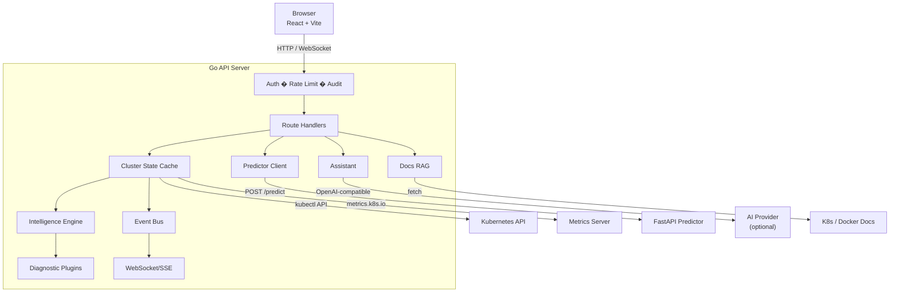
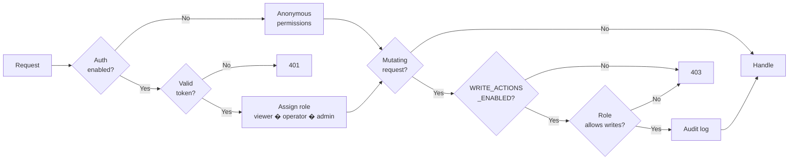
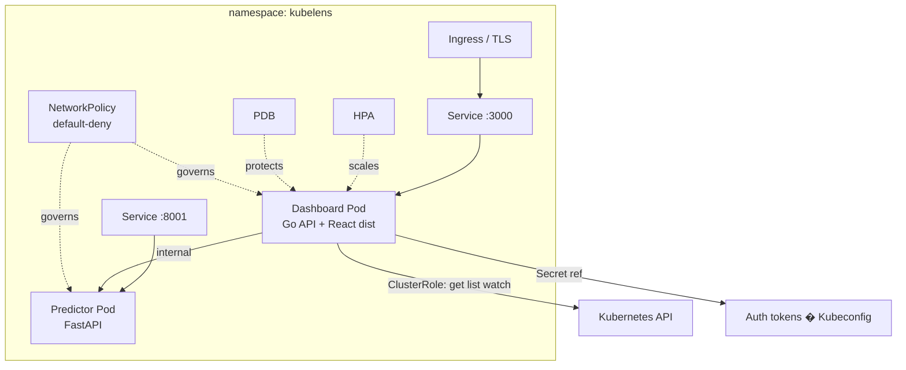

# Architecture

## System overview

## Auth and write gate

## Kubernetes deployment topology

## Components

- `src/` - React frontend, feature-oriented view folders
- `backend/` - Go API + Kubernetes integrations
- `predictor/` - FastAPI risk scoring service
- `k8s/` - Kustomize base + overlays (dev/demo/prod/tracing/observability)
- `helm/` - Helm chart for deployment

## Backend boundaries

- `internal/auth` - JWT/OIDC validation, roles, and request principals
- `internal/cluster` - Kubernetes data reads and operational commands
- `internal/state` - informer-backed cluster cache
- `internal/intelligence` - deterministic diagnostics + scoring
- `internal/diagnostics` - health scoring + narrative formatting
- `internal/events` - in-process event bus
- `internal/httpapi` - transport layer, auth/audit/rate-limit middleware, route handlers
- `internal/rag` - Kubernetes + Docker docs retrieval for assistant grounding
- `internal/config` - runtime config parsing + validation
- `internal/bootstrap` - dependency assembly and server construction

## Request flow

1. UI calls `/api/*`
2. Middleware enforces auth, rate limit, audit, and policy gates
3. Handlers read cached cluster state, run diagnostics/plugins, or call predictor
4. Results return as typed JSON to feature views

## Event streaming flow

1. Informers update the cluster cache
2. Cache emits events to the in-process bus
3. WebSocket/SSE stream publishes updates
4. UI refreshes views in near-real time

## Operational endpoints

| Endpoint                  | Description                                     |
| ------------------------- | ----------------------------------------------- |
| `/api/healthz`            | Liveness signal                                 |
| `/api/readyz`             | Readiness + dependency checks - 503 if degraded |
| `/api/metrics`            | JSON request telemetry                          |
| `/api/metrics/prometheus` | Prometheus exposition format                    |
| `/api/openapi.yaml`       | Published API contract                          |
