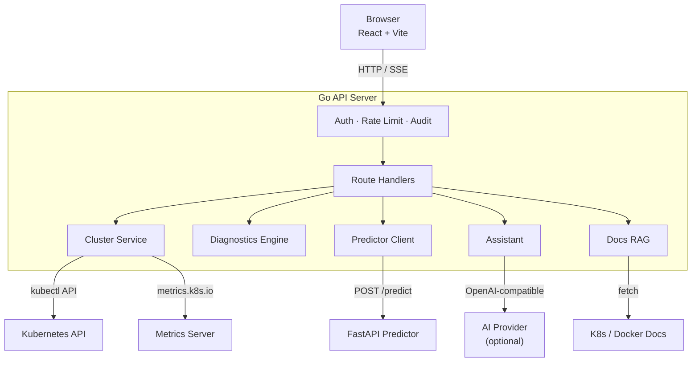
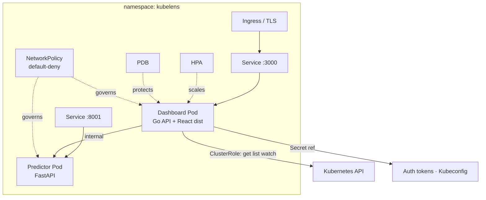

# Architecture

## System overview

## Auth and write gate

## Kubernetes deployment topology

## Components

- `src/` — React frontend, feature-oriented view folders
- `backend/` — Go API + Kubernetes integrations
- `predictor/` — FastAPI risk scoring service
- `k8s/` — Kustomize base + dev/demo/prod overlays

## Backend boundaries

- `internal/cluster` — Kubernetes data reads and operational commands
- `internal/diagnostics` — rule-based analysis engine + narrative formatting
- `internal/httpapi` — transport layer, auth/audit/rate-limit middleware, route handlers
- `internal/rag` — Kubernetes + Docker docs retrieval for assistant grounding
- `internal/config` — runtime config parsing + validation
- `internal/bootstrap` — dependency assembly and server construction

## Request flow

1. UI calls `/api/*`
2. Middleware enforces auth, rate limit, audit, and policy gates
3. Handlers call cluster/diagnostics/prediction/assistant services
4. Results return as typed JSON to feature views

## Mutating action safety flow

1. Route-level role requirement (`viewer` / `operator` / `admin`)
2. Global write gate (`WRITE_ACTIONS_ENABLED`)
3. Audit event persisted with actor + route + outcome

## Operational endpoints

| Endpoint                  | Description                                     |
| ------------------------- | ----------------------------------------------- |
| `/api/healthz`            | Liveness signal                                 |
| `/api/readyz`             | Readiness + dependency checks — 503 if degraded |
| `/api/metrics`            | JSON request telemetry                          |
| `/api/metrics/prometheus` | Prometheus exposition format                    |
| `/api/openapi.yaml`       | Published API contract                          |
