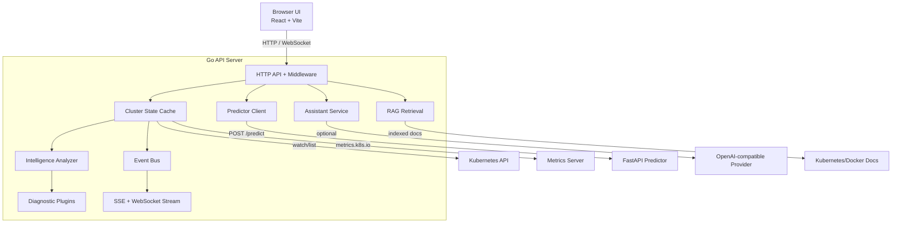

# Architecture

This document describes KubeLens runtime components, their boundaries, and data flow across the system.

## High-level architecture

## Service interactions

1. The UI calls `/api/*` for data reads, mutations, assistant requests, and operational workflows.
2. Middleware enforces auth, RBAC, rate limiting, CSRF checks (cookie-auth mutations), and audit logging.
3. Handlers read from cached cluster state and delegate to analyzers/predictor/assistant as needed.
4. Mutating routes call cluster writer operations only when write-gate and RBAC checks pass.
5. Result payloads are returned as typed JSON contracts consumed by the React frontend.

## Data flow

### Read path

1. Informer/watchers populate `internal/state` from Kubernetes resources.
2. `internal/cluster` maps raw Kubernetes objects to model summaries.
3. `internal/httpapi` handlers serve model data to frontend views.

### Diagnostics path

1. Snapshot data enters `internal/intelligence`.
2. Plugin analyzers (`backend/plugins/*`) emit deterministic diagnostics.
3. Diagnostics are formatted and returned via `/api/diagnostics`.

### Prediction path

1. API composes a prediction request from current pod/node/event state.
2. Request is sent to FastAPI predictor (`/predict`) when configured.
3. On failure, backend falls back to local deterministic prediction behavior.

### Assistant path

1. Assistant receives user query (`/api/assistant`).
2. Cluster context + diagnostics + optional memory/RAG references are assembled.
3. Optional LLM provider enriches the response; deterministic fallback remains available.

### Streaming path

1. Cache updates publish events to the in-process bus.
2. `/api/stream` and `/api/stream/ws` push updates to connected clients.
3. Frontend hooks reconcile stream events with local snapshots.

## Security and policy boundaries

- `internal/auth`: identity extraction and role evaluation.
- `auth.RequiredRole`: minimum route-level role.
- `auth.RequiresWriteGate`: global write-action gate for mutating routes.
- `internal/httpapi/audit`: per-request and mutating-action audit records.

## Storage model

- Primary runtime state is in-memory.
- Incident/remediation/postmortem stores are bounded in-memory collections.
- Cluster memory runbook store is persisted atomically to disk.

## Key packages

- `backend/internal/httpapi`: API transport, middleware, route handlers
- `backend/internal/cluster`: Kubernetes read/write integration layer
- `backend/internal/state`: cache and watcher-driven state updates
- `backend/internal/intelligence`: deterministic analysis engine
- `backend/internal/rag`: documentation retrieval and ranking
- `backend/internal/memory`: runbook/fix memory store
- `backend/internal/incident`: incident builder/runbook/store
- `backend/internal/remediation`: remediation proposal and execution flow
- `predictor/app`: FastAPI deterministic risk scoring service
- `src/`: frontend shell, hooks, views, and typed API client

## Operational endpoints

- `GET /api/healthz`: liveness probe
- `GET /api/readyz`: readiness and dependency checks
- `GET /api/metrics`: JSON API metrics
- `GET /api/metrics/prometheus`: Prometheus exposition format
- `GET /api/openapi.yaml`: canonical OpenAPI contract
